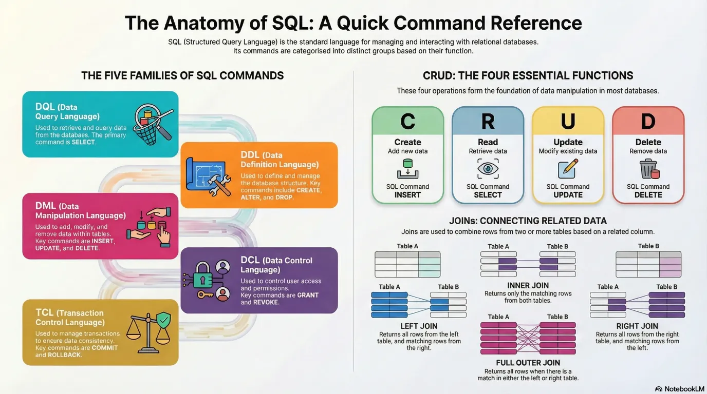
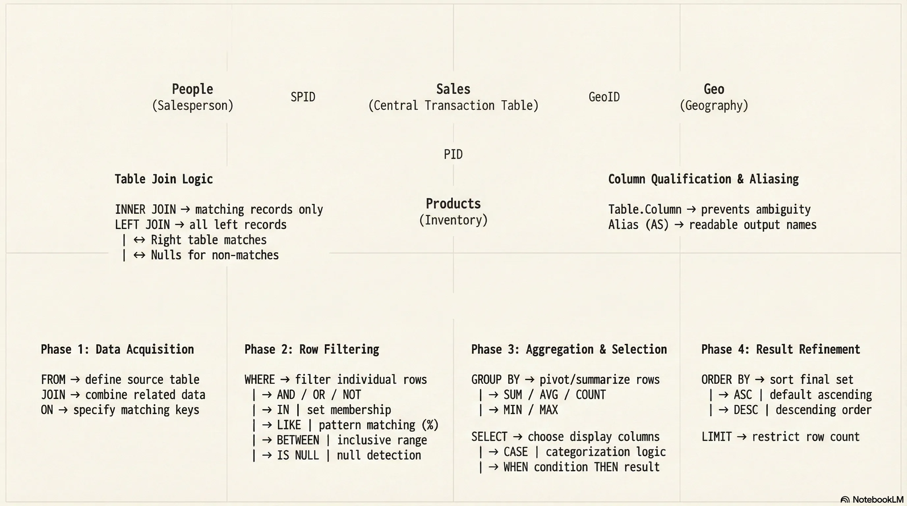
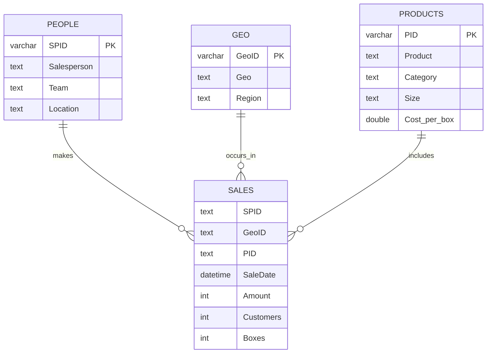
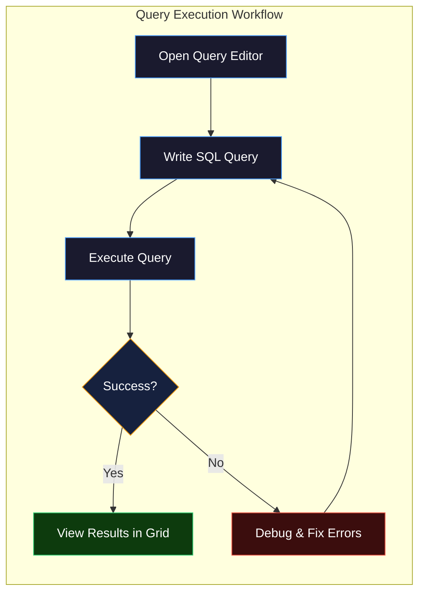
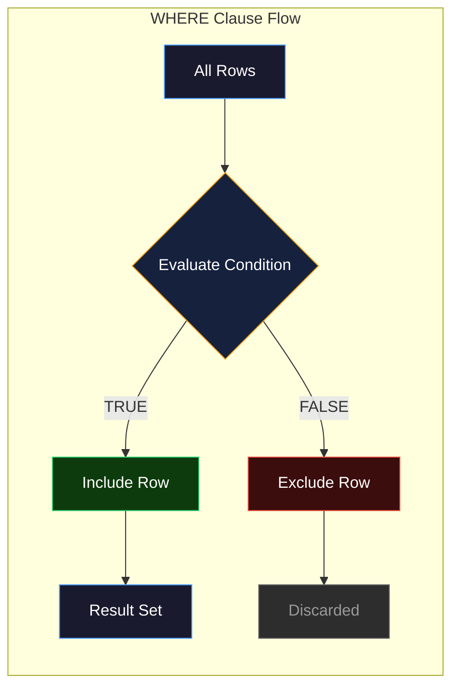
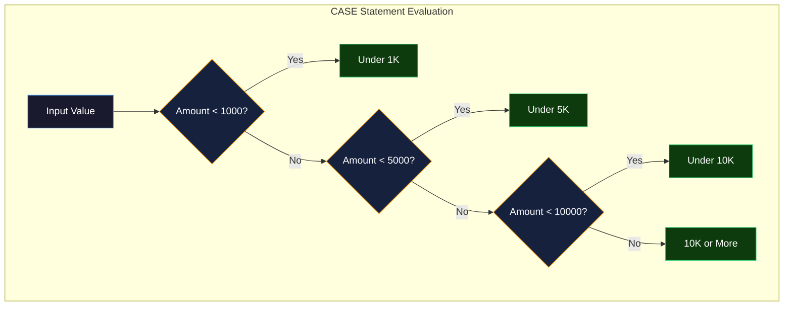
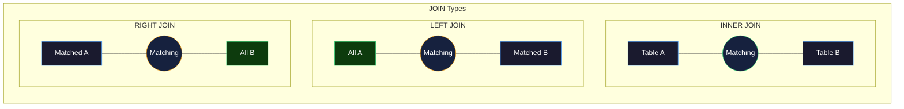
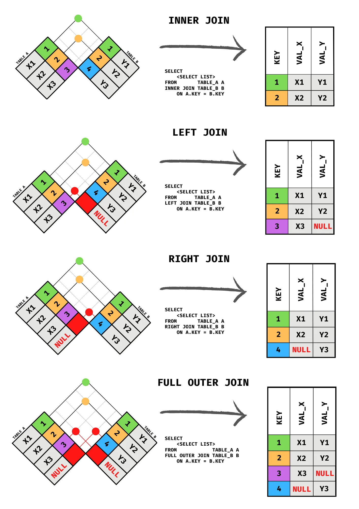
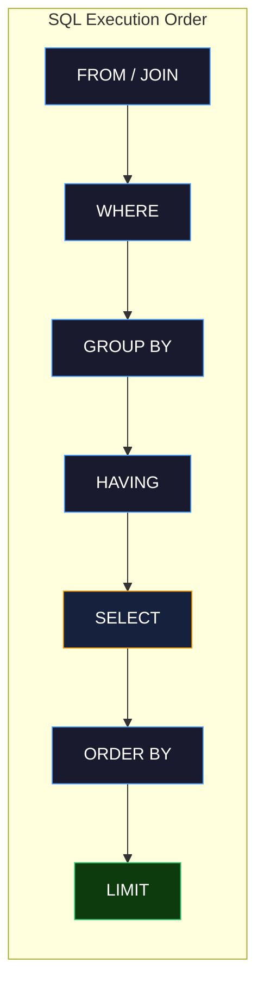
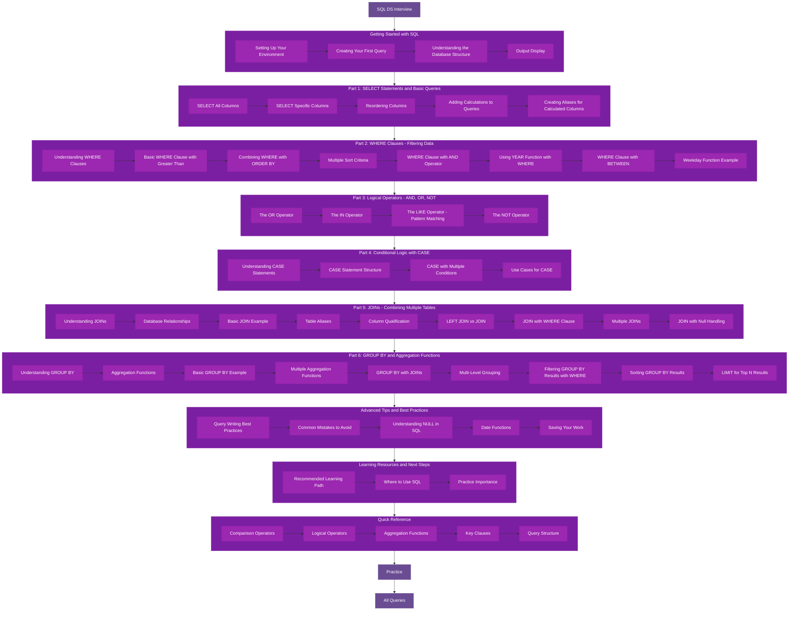

# SQL DS Interview



<div style="position:relative;width:100%;padding-bottom:56.25%;height:0;">
  <iframe
    src="https://www.youtube.com/embed/DZsyfrR-pV0?si=Zr_RnL9SEL7UyC4f"
    title="YouTube video player"
    style="position:absolute;top:0;left:0;width:100%;height:100%;border:0;"
    allow="accelerometer; autoplay; clipboard-write; encrypted-media; gyroscope; picture-in-picture; web-share"
    referrerpolicy="strict-origin-when-cross-origin"
    allowfullscreen>
  </iframe>
</div>

# Sample Database: Awesome Chocolates



- [Sample Database: Awesome Chocolates](https://github.com/kintsugi-programmer/kintsugi-stack-interview-sql-ds/blob/main/awesome-chocolates-data.sql)



## Getting Started with SQL

### Setting Up Your Environment

**Tool Used**: MySQL Workbench / BeeKeeper Studio

**Database**: Awesome Chocolates (must be downloaded and loaded)

### Creating Your First Query

1. Click the **Plus SQL button** in the corner to open the query editor
2. View output results directly in the workbench grid
3. Execute queries using **Ctrl + Enter** or the Run command



**Note**: Shortcuts differ depending on your system and SQL management tool:

- **MySQL Workbench**: Ctrl + Enter
- **SQL Server Management Studio (SSMS)**: Different shortcut
- **Oracle**: Different shortcut

### Understanding the Database Structure

> Whenever you are getting started, take some minutes to know your db, it will help you build better sql queries !!!

#### Available Tables in Awesome Chocolates Database

The database contains four main tables:

- **Geography** table
- **People** table
- **Products** table
- **Sales** table

#### Exploring Table Contents

Before writing queries, understand your data structure.

**View all tables in database**:
```sql
SHOW TABLES;
```

| Tables_in_awesome chocolates |
| ---------------------------- |
| geo                          |
| people                       |
| products                     |
| sales                        |

...

**View table structure and columns**:
```sql
DESCRIBE sales;
```

| Field     | Type     | Null | Key | Default | Extra |
| --------- | -------- | ---- | --- | ------- | ----- |
| SPID      | text     | YES  |     | null    |       |
| GeoID     | text     | YES  |     | null    |       |
| PID       | text     | YES  |     | null    |       |
| SaleDate  | datetime | YES  |     | null    |       |
| Amount    | int      | YES  |     | null    |       |

...

Actual mysql console response :

```
mysql> desc sales;
+-----------+----------+------+-----+---------+-------+
| Field     | Type     | Null | Key | Default | Extra |
+-----------+----------+------+-----+---------+-------+
| SPID      | text     | YES  |     | NULL    |       |
| GeoID     | text     | YES  |     | NULL    |       |
| PID       | text     | YES  |     | NULL    |       |
| SaleDate  | datetime | YES  |     | NULL    |       |
| Amount    | int      | YES  |     | NULL    |       |
| Customers | int      | YES  |     | NULL    |       |
| Boxes     | int      | YES  |     | NULL    |       |
+-----------+----------+------+-----+---------+-------+
7 rows in set (0.01 sec)

mysql> 
```

**What this returns**:

- Column names
- Data types
- Additional information about each column

#### Important Concept

**Critical Rule**: When writing SQL queries, you must be familiar with underlying tables and their relationships. Without this knowledge, writing SQL becomes extremely difficult.

### Output Display

**Query Limit**: MySQL Workbench displays a maximum of 1000 rows at a time, even if the table contains more data.

**Example**: Sales table contains ~7000 rows, but only 1000 display in the workbench

**When to Adjust Limits**:

- When building queries: You only need to verify it works correctly
- When exporting data: You may need to remove or increase the limit to see all data
- When using data elsewhere: Export to Power BI or other systems

---

## Part 1: SELECT Statements and Basic Queries

### SELECT All Columns

**Query**:
```sql
SELECT * FROM sales;
```

| SPID | GeoID | PID | SaleDate            | Amount | Customers | Boxes |
| ---- | ----- | --- | ------------------- | ------ | --------- | ----- |
| SP01 | G4    | P04 | 2021-01-01 00:00:00 | 8414   | 276       | 495   |
| SP02 | G3    | P14 | 2021-01-01 00:00:00 | 532    | 317       | 54    |
| SP12 | G2    | P08 | 2021-01-01 00:00:00 | 5376   | 178       | 269   |
| SP01 | G4    | P15 | 2021-01-01 00:00:00 | 259    | 32        | 22    |
| SP19 | G2    | P18 | 2021-01-01 00:00:00 | 5530   | 4         | 179   |

...

**Explanation**:

- `SELECT *` means select everything (all columns)
- `FROM sales` specifies the table name
- Displays all rows and all columns from the sales table

**Output**: Complete sales table with all data visible in grid format

### SELECT Specific Columns

**Query**:

```sql
SELECT saledate, amount, customers FROM sales;
```

| SaleDate            | Amount | Customers |
| ------------------- | ------ | --------- |
| 2021-01-01 00:00:00 | 8414   | 276       |
| 2021-01-01 00:00:00 | 532    | 317       |
| 2021-01-01 00:00:00 | 5376   | 178       |
| 2021-01-01 00:00:00 | 259    | 32        |
| 2021-01-01 00:00:00 | 5530   | 4         |

...

**Explanation**:

- Specify only the columns you want to see
- Columns are separated by commas
- Result shows only these three columns for all rows

**Auto-Suggest Feature**: Type the table name first, then add columns. This enables auto-suggest to help prevent spelling mistakes.

**Better Practice**:

```sql
SELECT 
FROM sales
```

Then come back and add columns between SELECT and FROM.

### Reordering Columns

**Query**:

```sql
SELECT amount, customers, geoid FROM sales;
```

| Amount | Customers | GeoID |
| ------ | --------- | ----- |
| 8414   | 276       | G4    |
| 532    | 317       | G3    |
| 5376   | 178       | G2    |
| 259    | 32        | G4    |
| 5530   | 4         | G2    |

...

**Explanation**:

- Columns do not have to appear in their original database order
- They display in the order you specify in the SELECT statement
- Results are rearranged automatically based on your specification

### Adding Calculations to Queries

**Calculate Amount Per Box**:
```sql
SELECT 
  saledate,
  amount,
  boxes,
  amount / boxes
FROM sales;
```

| SaleDate            | Amount | Boxes | Amount/Boxes |
| ------------------- | ------ | ----- | ------------- |
| 2021-01-01 00:00:00 | 8414   | 495   | 16.9980       |
| 2021-01-01 00:00:00 | 532    | 54    | 9.8519        |
| 2021-01-01 00:00:00 | 5376   | 269   | 19.9851       |
| 2021-01-01 00:00:00 | 259    | 22    | 11.7727       |
| 2021-01-01 00:00:00 | 5530   | 179   | 30.8939       |

...

**Explanation**:

- You can perform arithmetic operations directly in SELECT statements
- Operations include addition (+), subtraction (-), multiplication (*), division (/)
- Results appear as an extra column in the output
- The calculated column name defaults to the operation itself

### Creating Aliases for Calculated Columns

**Problem**: Column name `amount / boxes` is not user-friendly

**Solution: Add Column Aliases Using AS**:

```sql
SELECT 
  saledate,
  amount,
  boxes,
  amount / boxes AS 'amount_per_box'
FROM sales;
```

| SaleDate            | Amount | Boxes | amount_per_box |
| ------------------- | ------ | ----- | -------------- |
| 2021-01-01 00:00:00 | 8414   | 495   | 16.9980        |
| 2021-01-01 00:00:00 | 532    | 54    | 9.8519         |
| 2021-01-01 00:00:00 | 5376   | 269   | 19.9851        |
| 2021-01-01 00:00:00 | 259    | 22    | 11.7727        |
| 2021-01-01 00:00:00 | 5530   | 179   | 30.8939        |

...

**Alternative Without AS Keyword**:

```sql
SELECT 
  saledate,
  amount,
  boxes,
  amount / boxes 'amount_per_box'
FROM sales;
```

| SaleDate            | Amount | Boxes | amount_per_box |
| ------------------- | ------ | ----- | -------------- |
| 2021-01-01 00:00:00 | 8414   | 495   | 16.9980        |
| 2021-01-01 00:00:00 | 532    | 54    | 9.8519         |
| 2021-01-01 00:00:00 | 5376   | 269   | 19.9851        |
| 2021-01-01 00:00:00 | 259    | 22    | 11.7727        |
| 2021-01-01 00:00:00 | 5530   | 179   | 30.8939        |

```sql
select
  SaleDate,
  Amount,
  Boxes,
  Amount/Boxes 'amount per box'
from sales;
```

| SaleDate            | Amount | Boxes | amount per box |
| ------------------- | ------ | ----- | -------------- |
| 2021-01-01 00:00:00 | 8414   | 495   | 16.9980        |
| 2021-01-01 00:00:00 | 532    | 54    | 9.8519         |
| 2021-01-01 00:00:00 | 5376   | 269   | 19.9851        |
| 2021-01-01 00:00:00 | 259    | 22    | 11.7727        |
| 2021-01-01 00:00:00 | 5530   | 179   | 30.8939        |

**Note**: Both methods produce identical results. The AS keyword creates a synonym for the column.

### Key Takeaway on Aliases

The alias makes your output more readable and professional. Many times you want to give calculated columns proper names for clarity.

---

## Part 2: WHERE Clauses - Filtering Data

### Understanding WHERE Clauses

**Definition**: The WHERE clause allows you to impose conditions on your query results.

**Concept**: WHERE clause in SQL is like filtering in Excel. Set filter criteria to show only specific data.

**Importance**: WHERE clauses are one of the most important aspects of SQL for data analysis.



### Basic WHERE Clause with Greater Than

**Query**:

```sql
SELECT * FROM sales
WHERE amount > 10000;
```

| SPID | GeoID | PID | SaleDate            | Amount | Customers | Boxes |
| ---- | ----- | --- | ------------------- | ------ | --------- | ----- |
| SP06 | G4    | P01 | 2021-01-01 00:00:00 | 12894  | 115       | 478   |
| SP10 | G1    | P06 | 2021-01-01 00:00:00 | 15596  | 32        | 975   |
| SP25 | G6    | P05 | 2021-01-01 00:00:00 | 14273  | 335       | 752   |
| SP18 | G2    | P21 | 2021-01-04 00:00:00 | 19229  | 64        | 1013  |
| SP23 | G1    | P16 | 2021-01-05 00:00:00 | 17248  | 163       | 664   |

...

**Explanation**:

- `WHERE` specifies the filter condition
- `amount > 10000` means only rows where amount is greater than 10,000
- All rows where amount is NOT greater than 10,000 are excluded
- Only qualifying rows display in results

**Comparison Operators**:

- `>` Greater than
- `<` Less than
- `=` Equal to
- `>=` Greater than or equal to
- `<=` Less than or equal to
- `!=` or `<>` Not equal to

### Combining WHERE with ORDER BY

**Query**:

```sql
SELECT * FROM sales
WHERE amount > 10000
ORDER BY amount;
```

| SPID | GeoID | PID | SaleDate            | Amount | Customers | Boxes |
| ---- | ----- | --- | ------------------- | ------ | --------- | ----- |
| SP02 | G1    | P07 | 2021-09-17 00:00:00 | 10010  | 257       | 358   |
| SP01 | G2    | P17 | 2021-08-30 00:00:00 | 10017  | 163       | 835   |
| SP21 | G3    | P22 | 2021-11-18 00:00:00 | 10017  | 111       | 418   |
| SP18 | G5    | P18 | 2021-10-27 00:00:00 | 10017  | 77        | 1113  |
| SP23 | G5    | P03 | 2021-05-06 00:00:00 | 10024  | 32        | 627   |

...

**Explanation**:

- Filters results to show only amounts greater than 10,000
- Orders results by amount in ascending order (lowest to highest)
- Results start at 10,000+ and increase gradually

**Ascending Order (Default)**:

```sql
SELECT * FROM sales
WHERE amount > 10000
ORDER BY amount;
```

| SPID | GeoID | PID | SaleDate            | Amount | Customers | Boxes |
| ---- | ----- | --- | ------------------- | ------ | --------- | ----- |
| SP02 | G1    | P07 | 2021-09-17 00:00:00 | 10010  | 257       | 358   |
| SP01 | G2    | P17 | 2021-08-30 00:00:00 | 10017  | 163       | 835   |
| SP21 | G3    | P22 | 2021-11-18 00:00:00 | 10017  | 111       | 418   |
| SP18 | G5    | P18 | 2021-10-27 00:00:00 | 10017  | 77        | 1113  |
| SP23 | G5    | P03 | 2021-05-06 00:00:00 | 10024  | 32        | 627   |

...

**Descending Order (Highest to Lowest)**:

```sql
SELECT * FROM sales
WHERE amount > 10000
ORDER BY amount DESC;
```

| SPID | GeoID | PID | SaleDate            | Amount | Customers | Boxes |
| ---- | ----- | --- | ------------------- | ------ | --------- | ----- |
| SP23 | G4    | P03 | 2021-02-12 00:00:00 | 27146  | 329       | 1939  |
| SP18 | G5    | P10 | 2021-04-22 00:00:00 | 25207  | 22        | 1483  |
| SP03 | G5    | P22 | 2021-06-02 00:00:00 | 24633  | 39        | 986   |
| SP18 | G1    | P11 | 2021-10-21 00:00:00 | 24451  | 472       | 1112  |
| SP18 | G2    | P16 | 2021-03-30 00:00:00 | 24367  | 272       | 3481  |

...

### Multiple Sort Criteria

**Query**:

```sql
SELECT * FROM sales
WHERE geoid = 'g1'
ORDER BY pid, amount DESC;
```

| SPID | GeoID | PID | SaleDate            | Amount | Customers | Boxes |
| ---- | ----- | --- | ------------------- | ------ | --------- | ----- |
| SP14 | G1    | P01 | 2022-02-25 00:00:00 | 22897  | 43        | 1347  |
| SP21 | G1    | P01 | 2022-01-07 00:00:00 | 18130  | 24        | 1008  |
| SP11 | G1    | P01 | 2021-01-27 00:00:00 | 17402  | 43        | 697   |
| SP08 | G1    | P01 | 2021-09-13 00:00:00 | 16681  | 274       | 596   |
| SP08 | G1    | P01 | 2022-01-10 00:00:00 | 16121  | 55        | 896   |

...

**Explanation**:

- Filters to show only GeoID 'g1' records
- First sorts by product ID (pid)
- Within each product ID, sorts by amount in descending order
- You can specify multiple ORDER BY columns separated by commas

**Result Structure**:

- All p01 items grouped together, sorted by amount (highest first)
- Then p02 items grouped together, sorted by amount
- Then p03, p04, etc.

### WHERE Clause with AND Operator

**Scenario**: Find all sales with amount > 10,000 in the year 2022

**Query Method 1 - Using Date Comparison**:

```sql
SELECT * FROM sales
WHERE amount > 10000
AND saledate >= '2022-01-01';
-- use quote in dates `2022-01-01' : correct, 2022-01-01 : incorrect
```

| SPID | GeoID | PID | SaleDate            | Amount | Customers | Boxes |
| ---- | ----- | --- | ------------------- | ------ | --------- | ----- |
| SP15 | G3    | P11 | 2022-01-05 00:00:00 | 14553  | 152       | 910   |
| SP16 | G3    | P22 | 2022-01-28 00:00:00 | 10255  | 53        | 733   |
| SP04 | G4    | P05 | 2022-01-28 00:00:00 | 16800  | 92        | 800   |
| SP05 | G1    | P02 | 2022-01-21 00:00:00 | 16121  | 487       | 621   |
| SP21 | G2    | P22 | 2022-01-11 00:00:00 | 12481  | 177       | 1041  |

...

**Explanation**:

- Filters to amount greater than 10,000
- AND date is within 2022 or later
- Both conditions must be true for rows to display

**MySQL Date Format**: YYYY-MM-DD

**Date Example**: `2022-01-01` represents January 1st, 2022

### Using YEAR Function with WHERE

**Query Method 2 - Using YEAR Function**:

```sql
SELECT saledate, amount 
FROM sales
WHERE amount > 10000
AND YEAR(saledate) = 2022
ORDER BY amount DESC;
```

| saledate            | amount |
| ------------------- | ------ |
| 2022-02-16 00:00:00 | 23912  |
| 2022-03-15 00:00:00 | 23184  |
| 2022-02-25 00:00:00 | 22897  |
| 2022-03-01 00:00:00 | 22603  |
| 2022-02-25 00:00:00 | 22155  |

...

**Explanation**:

- `YEAR()` is a built-in SQL function that extracts the year from a date
- Works similar to YEAR function in Excel
- Returns a number, so no quotes needed around 2022
- More flexible than date comparison method

**Advantage**: Cleaner and more maintainable than parsing dates manually

### WHERE Clause with BETWEEN

**Scenario**: Find all sales with boxes between 0 and 50

**Query Method 1 - Using AND**:

```sql
SELECT * FROM sales
WHERE boxes > 0
AND boxes <= 50;
```

| SPID | GeoID | PID | SaleDate            | Amount | Customers | Boxes |
| ---- | ----- | --- | ------------------- | ------ | --------- | ----- |
| SP01 | G4    | P15 | 2021-01-01 00:00:00 | 259    | 32        | 22    |
| SP14 | G5    | P16 | 2021-01-01 00:00:00 | 1036   | 370       | 37    |
| SP12 | G6    | P09 | 2021-01-04 00:00:00 | 147    | 9         | 11    |
| SP04 | G1    | P20 | 2021-01-06 00:00:00 | 644    | 116       | 34    |
| SP10 | G2    | P01 | 2021-01-08 00:00:00 | 420    | 196       | 14    |

...

**Query Method 2 - Using BETWEEN(it includes limits)**:

```sql
SELECT * FROM sales
WHERE boxes BETWEEN 0 AND 50;
```

| SPID | GeoID | PID | SaleDate            | Amount | Customers | Boxes |
| ---- | ----- | --- | ------------------- | ------ | --------- | ----- |
| SP01 | G4    | P15 | 2021-01-01 00:00:00 | 259    | 32        | 22    |
| SP14 | G5    | P16 | 2021-01-01 00:00:00 | 1036   | 370       | 37    |
| SP12 | G6    | P09 | 2021-01-04 00:00:00 | 147    | 9         | 11    |
| SP04 | G1    | P20 | 2021-01-06 00:00:00 | 644    | 116       | 34    |
| SP10 | G2    | P01 | 2021-01-08 00:00:00 | 420    | 196       | 14    |

...

**Explanation**:

- BETWEEN is inclusive on both ends
- **Range includes 0 and 50**
- Both methods produce the same results
- BETWEEN is more concise and readable

**Note**: Both methods are valid. Use whichever is more comfortable for you.

### Weekday Function Example

**Scenario**: Find all sales that occurred on Fridays

**Query**:

```sql
SELECT 
  saledate,
  amount,
  boxes,
  WEEKDAY(saledate) AS day_of_week
FROM sales
WHERE WEEKDAY(saledate) = 4;
```

| SaleDate            | Amount | Boxes | day_of_week |
| ------------------- | ------ | ----- | ----------- |
| 2021-01-01 00:00:00 | 8414   | 495   | 4           |
| 2021-01-01 00:00:00 | 532    | 54    | 4           |
| 2021-01-01 00:00:00 | 5376   | 269   | 4           |
| 2021-01-01 00:00:00 | 259    | 22    | 4           |
| 2021-01-01 00:00:00 | 5530   | 179   | 4           |

**Explanation**:

- `WEEKDAY()` is a built-in function that returns day of week as a number
- Weekday numbering: 0=Monday, 1=Tuesday, 2=Wednesday, 3=Thursday, 4=Friday, 5=Saturday, 6=Sunday
- Friday = 4, so the condition is `WEEKDAY(SaleDate) = 4`
- Can also create alias `AS day_of_week` for clarity

**Important Note**: When using a calculated column in WHERE clause, you cannot reference the alias. You must repeat the calculation:

```sql
-- CORRECT:
WHERE WEEKDAY(SaleDate) = 4

-- INCORRECT (will give error):
WHERE day_of_week = 4
```

---

## Part 3: Logical Operators - AND, OR, NOT

### The OR Operator

**Scenario**: Find all people in either "Delish" or "Juices" team

**Query Method 1 - Using Multiple OR Conditions**:

```sql
SELECT * FROM people
WHERE team = 'Delish'
OR team = 'Juices';
```

| Salesperson      | SPID | Team   | Location   |
| ---------------- | ---- | ------ | ---------- |
| Wilone O'Kielt   | SP04 | Delish | Hyderabad  |
| Gigi Bohling     | SP05 | Delish | Hyderabad  |
| Curtice Advani   | SP06 | Delish | Hyderabad  |
| Kaine Padly      | SP07 | Delish | Hyderabad  |
| Andria Kimpton   | SP09 | Jucies | Hyderabad  |

...

**Explanation**:

- Shows results where team equals 'Delish' OR team equals 'Juices'
- Either condition being true includes the row
- Person cannot be in both teams, so OR is appropriate

**Limitation**: If you need many possible values, OR conditions become repetitive and difficult to maintain

### The IN Operator

**Query Method 2 - Using IN (Cleaner Approach)**:

```sql
SELECT * FROM people
WHERE team IN ('Delish', 'Juices');
```

| Salesperson      | SPID | Team   | Location   |
| ---------------- | ---- | ------ | ---------- |
| Wilone O'Kielt   | SP04 | Delish | Hyderabad  |
| Gigi Bohling     | SP05 | Delish | Hyderabad  |
| Curtice Advani   | SP06 | Delish | Hyderabad  |
| Kaine Padly      | SP07 | Delish | Hyderabad  |
| Andria Kimpton   | SP09 | Jucies | Hyderabad  |

...

**Explanation**:

- `IN` is shorthand for multiple OR conditions
- Specify multiple values in parentheses, separated by commas
- All text values must be in single quotes
- More flexible when you have many possible values
- More readable and maintainable

**Advantage over OR**: When you need 5, 7, or 10+ possible values, IN is much cleaner than chaining multiple OR conditions.

### The LIKE Operator - Pattern Matching

**Scenario**: Find all people whose name begins with 'B'

**Query**:

```sql
SELECT * FROM people
WHERE salesperson LIKE 'B%';
```

| Salesperson      | SPID | Team    | Location   |
| ---------------- | ---- | ------- | ---------- |
| Barr Faughny     | SP01 | Yummies | Hyderabad  |
| Brien Boise      | SP10 | Jucies  | Wellington |
| Beverie Moffet   | SP19 | Jucies  | Seattle    |
| Benny Karolovsky | SP32 | Jucies  | Paris      |

...

**Explanation**:

- `LIKE` operator performs pattern matching
- `B%` means: starts with 'B', followed by anything (%)
- `%` is a wildcard meaning "any character, zero or more times"
- Names starting with B: Boris, Bonnie, etc.

**Pattern Matching Examples**:

**Find names starting with B**:

```sql
SELECT * FROM people
WHERE salesperson LIKE 'B%';
```

| Salesperson      | SPID | Team    | Location   |
| ---------------- | ---- | ------- | ---------- |
| Barr Faughny     | SP01 | Yummies | Hyderabad  |
| Brien Boise      | SP10 | Jucies  | Wellington |
| Beverie Moffet   | SP19 | Jucies  | Seattle    |
| Benny Karolovsky | SP32 | Jucies  | Paris      |

**Find names containing B anywhere**:

```sql
SELECT * FROM people
WHERE salesperson LIKE '%B%';
```

| Salesperson         | SPID | Team    | Location   |
| ------------------- | ---- | ------- | ---------- |
| Barr Faughny        | SP01 | Yummies | Hyderabad  |
| Gigi Bohling        | SP05 | Delish  | Hyderabad  |
| Ches Bonnell        | SP08 |         | Hyderabad  |
| Brien Boise         | SP10 | Jucies  | Wellington |
| Marney O'Breen      | SP16 | Jucies  | Wellington |

...

**Find names ending with l**:

```sql
SELECT * FROM people
WHERE salesperson LIKE '%l';
```

| Salesperson  | SPID | Team    | Location  |
| ------------ | ---- | ------- | --------- |
| Ches Bonnell | SP08 |         | Hyderabad |
| Oby Sorrel   | SP20 | Jucies  | Seattle   |
| Van Tuxwell  | SP23 | Yummies | Seattle   |

...

**Find names with B as second character**:
```sql
LIKE '_B%'
```

| Salesperson     | SPID | Team   | Location |
| --------------- | ---- | ------ | -------- |
| Oby Sorrel      | SP20 | Jucies | Seattle  |
| Ebonee Roxburgh | SP28 |        | Paris    |

...

(Where `_` means exactly one character)

### The NOT Operator

**Scenario**: Find sales where the team is NOT equal to a specific value

**Query**:

```sql
select * from products
where Category != 'Bars';
-- OR --
select * from products
where Category <> 'Bars';
-- OR --
select * from products
where not (Category = 'Bars');
```

| PID | Product              | Category | Size  | Cost_per_box |
| --- | -------------------- | -------- | ----- | ------------ |
| P02 | 50% Dark Bites       | Bites    | LARGE | 2.57         |
| P06 | Eclairs              | Bites    | LARGE | 2.24         |
| P07 | Drinking Coco        | Other    | LARGE | 1.62         |
| P10 | Spicy Special Slims  | Bites    | LARGE | 5.79         |
| P11 | After Nines          | Bites    | LARGE | 4.43         |
| P14 | White Choc           | Other    | SMALL | 0.16         |

...

**Explanation**:

- `!=` and `<>` both mean "not equal to"
- `NOT` operator reverses a condition
- All three queries produce identical results

---

## Part 4: Conditional Logic with CASE

### Understanding CASE Statements

**Purpose**: Create **categorizations** or conditional logic within SELECT statements

**Scenario**: Categorize sales amounts into different tiers:

- Under $1,000: "Under 1K"
- $1,000 to $5,000: "Under 5K"
- $5,000 to $10,000: "Under 10K"
- Over $10,000: "10K or More"



### CASE Statement Structure

**Query**:

```sql
select SaleDate,Amount ,case when Amount < 1000 then 'Under 1K' when Amount < 5000 then 'Under 2K' when Amount < 10000 then 'Under 10K' else '10K or More' end as amount_category from sales ;
```

| SaleDate            | Amount | amount_category |
| ------------------- | ------ | --------------- |
| 2021-01-01 00:00:00 | 8414   | Under 10K       |
| 2021-01-01 00:00:00 | 532    | Under 1K        |
| 2021-01-01 00:00:00 | 5376   | Under 10K       |
| 2021-01-01 00:00:00 | 259    | Under 1K        |
| 2021-01-01 00:00:00 | 5530   | Under 10K       |

...

**Explanation**:

- `CASE` begins the conditional logic
- `WHEN condition THEN result` checks each condition sequentially
- Conditions are evaluated in order from top to bottom
- First matching condition returns its result
- `ELSE` provides default value if no conditions match
- `END` terminates the CASE statement
- Assign alias `AS amount_category` to name the result column

### CASE with Multiple Conditions

You can use multiple WHEN statements and combine conditions as needed.

**Query Structure Best Practices**:

For clarity in longer queries, break CASE statements into multiple lines:

```sql
SELECT 
  saledate,
  amount 
  ,CASE
    WHEN amount < 1000 THEN 'Under 1K'
    WHEN amount < 5000 THEN 'Under 5K'
    WHEN amount < 10000 THEN 'Under 10K'
    ELSE '10K or More'
  END AS amount_category
FROM sales;
```

| SaleDate            | Amount | amount_category |
| ------------------- | ------ | --------------- |
| 2021-01-01 00:00:00 | 8414   | Under 10K       |
| 2021-01-01 00:00:00 | 532    | Under 1K        |
| 2021-01-01 00:00:00 | 5376   | Under 10K       |
| 2021-01-01 00:00:00 | 259    | Under 1K        |
| 2021-01-01 00:00:00 | 5530   | Under 10K       |

...

### Use Cases for CASE

- Create numeric categorizations
- Create text-based categorizations
- Use in WHERE clause to filter on categorizations
- Map values for reporting and analysis
- Create custom display values

---

## Part 5: JOINs - Combining Multiple Tables

### Understanding JOINs

**Definition**: JOINs combine data from multiple tables based on related columns.

**Concept**: Similar to VLOOKUP in Excel, but SQL uses more optimized methods.

**Critical Prerequisite**: Understand how tables are linked through foreign keys before attempting JOINs.





### Database Relationships in Awesome Chocolates

**Table Relationships**:

- Sales table contains: `SPID` (links to People table)
- Sales table contains: `pid` (links to Products table)
- Sales table contains: `GeoID` (links to Geography table)

**Principle**: IDs that appear in multiple tables represent the same entity and can be used to JOIN tables.

### Basic JOIN Example

**Scenario**: Show sales data with the person's name instead of just ID

**Without JOIN - Problem**:

```sql
SELECT * FROM sales;
-- Shows sp01, sp02, etc. but we don't know who these people are
```

| SPID | GeoID | PID | SaleDate            | Amount | Customers | Boxes |
| ---- | ----- | --- | ------------------- | ------ | --------- | ----- |
| SP01 | G4    | P04 | 2021-01-01 00:00:00 | 8414   | 276       | 495   |
| SP02 | G3    | P14 | 2021-01-01 00:00:00 | 532    | 317       | 54    |
| SP12 | G2    | P08 | 2021-01-01 00:00:00 | 5376   | 178       | 269   |
| SP01 | G4    | P15 | 2021-01-01 00:00:00 | 259    | 32        | 22    |
| SP19 | G2    | P18 | 2021-01-01 00:00:00 | 5530   | 4         | 179   |

...

**With JOIN - Solution**:

```sql
select 
  s.SaleDate,
  s.Amount,
  p.Salesperson
from sales s
join people p on p.SPID = s.SPID;
```

| SaleDate            | Amount | Salesperson         |
| ------------------- | ------ | ------------------- |
| 2021-01-01 00:00:00 | 8414   | Barr Faughny        |
| 2021-01-01 00:00:00 | 532    | Dennison Crosswaite |
| 2021-01-01 00:00:00 | 5376   | Karlen McCaffrey    |
| 2021-01-01 00:00:00 | 259    | Barr Faughny        |
| 2021-01-01 00:00:00 | 5530   | Beverie Moffet      |

...

```sql
select
  s.SaleDate,
  s.Amount,
  p.Salesperson,
  s.SPID,
  p.SPID
from sales s
  join people p on p.SPID = s.SPID
;
```

| SaleDate            | Amount | Salesperson         | SPID |
| ------------------- | ------ | ------------------- | ---- |
| 2021-01-01 00:00:00 | 8414   | Barr Faughny        | SP01 |
| 2021-01-01 00:00:00 | 532    | Dennison Crosswaite | SP02 |
| 2021-01-01 00:00:00 | 5376   | Karlen McCaffrey    | SP12 |
| 2021-01-01 00:00:00 | 259    | Barr Faughny        | SP01 |
| 2021-01-01 00:00:00 | 5530   | Beverie Moffet      | SP19 |

**Explanation**:

- `FROM sales s` starts with sales table, aliased as 's'
- `JOIN people p` adds the people table, aliased as 'p'
- `ON p.SPID = s.SPID` specifies the join condition - matching IDs
- `s.` and `p.` prefixes specify which table a column comes from
- When IDs match, data from both tables appears on the same row

### Table Aliases

**Purpose**: Shorten long table names and make queries more readable

**Syntax**:
```sql
FROM sales s
-- OR --
FROM sales AS s
```

**Consistency Practice**: Use consistent aliases within your query. Example:

- `s` for sales
- `p` for people
- `pr` for products
- `g` for geo

### Column Qualification

**Why Qualify Columns with Table Prefix?**

When columns have the same name in multiple tables, prefix with table alias:

```sql
s.SPID    -- sales table's SPID
p.SPID    -- people table's SPID
```

**Best Practice**: Even when not required, qualify columns for clarity.

### LEFT JOIN vs JOIN

**JOIN (INNER JOIN)**:

- Returns only rows where IDs match in BOTH tables
- If sales table has SPID that doesn't exist in people table, that row is excluded

**LEFT JOIN**:

- Returns ALL rows from the left table (first table after FROM)
- Includes matching rows from the right table
- If no match found, right table columns show as blank/NULL
- Used to preserve all data from the primary table

**Visual Representation**:

```
Sales table (LEFT) ----------- People table (RIGHT)
[Keep ALL from sales]
[If match in people → Include people data]
[If no match in people → Show blank for people columns]
```

**When to Use LEFT JOIN**: Most common in business situations because you want to preserve all sales data even if the person's record doesn't exist in the people table.

```sql
select 
  s.SaleDate,
  s.Amount,
  pr.Product
from sales s 
  left join products pr on pr.PID = s.PID
;
```

| SaleDate            | Amount | Product              |
| ------------------- | ------ | -------------------- |
| 2021-01-01 00:00:00 | 8414   | Raspberry Choco      |
| 2021-01-01 00:00:00 | 532    | White Choc           |
| 2021-01-01 00:00:00 | 5376   | 99% Dark & Pure      |
| 2021-01-01 00:00:00 | 259    | Baker's Choco Chips  |
| 2021-01-01 00:00:00 | 5530   | Manuka Honey Choco   |

...

```sql
select 
  s.SaleDate,
  s.Amount,
  pr.Product
from sales s 
  right join products pr on pr.PID = s.PID
;
```

| SaleDate            | Amount | Product              |
| ------------------- | ------ | -------------------- |
| 2022-03-23 00:00:00 | 637    | Milk Bars            |
| 2022-02-25 00:00:00 | 2730   | Milk Bars            |
| 2022-02-24 00:00:00 | 9023   | Milk Bars            |
| 2022-03-04 00:00:00 | 1155   | Milk Bars            |
| 2022-03-30 00:00:00 | 1120   | Milk Bars            |

...


### JOIN with WHERE Clause

**Scenario**: Show sales under $500 for people in the "Delish" team

**Query**:

```sql
SELECT 
  s.SaleDate,
  s.amount,
  p.salesperson,
  p.team
FROM sales s
JOIN people p ON p.SPID = s.SPID
WHERE s.amount < 500
AND p.team = 'Delish';
```

| SaleDate            | Amount | Salesperson     | Team   |
| ------------------- | ------ | --------------- | ------ |
| 2021-01-08 00:00:00 | 364    | Gigi Bohling    | Delish |
| 2021-01-14 00:00:00 | 35     | Jan Morforth    | Delish |
| 2021-01-15 00:00:00 | 308    | Curtice Advani  | Delish |
| 2021-02-04 00:00:00 | 182    | Camilla Castle  | Delish |
| 2021-02-04 00:00:00 | 392    | Jan Morforth    | Delish |

...

**Explanation**:

- JOIN combines the tables
- WHERE clause filters results on joined data
- Can filter on any column from either table

for fun, see the empty stuff !!!

```sql
select
  s.SaleDate,
  s.Amount,
  p.Salesperson,
  p.Team
from sales s 
  join people p on p.SPID = s.SPID
  where s.Amount< 500
;
```

| SaleDate            | Amount | Salesperson         | Team    |
| ------------------- | ------ | ------------------- | ------- |
| 2021-01-01 00:00:00 | 259    | Barr Faughny        | Yummies |
| 2021-01-04 00:00:00 | 147    | Karlen McCaffrey    | Yummies |
| 2021-01-08 00:00:00 | 420    | Brien Boise         | Jucies  |
| 2021-01-08 00:00:00 | 364    | Gigi Bohling        | Delish  |
| 2021-01-08 00:00:00 | 357    | Ches Bonnell        |         |
| 2021-01-12 00:00:00 | 189    | Husein Augar        | Yummies |
| 2021-01-12 00:00:00 | 490    | Barr Faughny        | Yummies |
| 2021-01-14 00:00:00 | 35     | Jan Morforth        | Delish  |
| 2021-01-15 00:00:00 | 308    | Curtice Advani      | Delish  |
| 2021-01-18 00:00:00 | 238    | Brien Boise         | Jucies  |
| 2021-01-19 00:00:00 | 161    | Ches Bonnell        |         |
| 2021-01-20 00:00:00 | 343    | Brien Boise         | Jucies  |
| 2021-01-20 00:00:00 | 126    | Kelci Walkden       | Yummies |
| 2021-01-21 00:00:00 | 280    | Ches Bonnell        |         |
| 2021-01-21 00:00:00 | 427    | Marney O'Breen      | Jucies  |
| 2021-01-22 00:00:00 | 168    | Oby Sorrel          | Jucies  |
| 2021-01-25 00:00:00 | 42     | Ches Bonnell        |         |
| 2021-01-25 00:00:00 | 343    | Mallorie Waber      |         |

...

```sql
select
  s.SaleDate,
  s.Amount,
  p.Salesperson,
  p.Team
from sales s 
  join people p on p.SPID = s.SPID
  where s.Amount< 500
  and p.Team = ''
; 
```

| SaleDate            | Amount | Salesperson         | Team |
| ------------------- | ------ | ------------------- | ---- |
| 2021-01-08 00:00:00 | 357    | Ches Bonnell        |      |
| 2021-01-19 00:00:00 | 161    | Ches Bonnell        |      |
| 2021-01-21 00:00:00 | 280    | Ches Bonnell        |      |
| 2021-01-25 00:00:00 | 42     | Ches Bonnell        |      |
| 2021-01-25 00:00:00 | 343    | Mallorie Waber      |      |

...

### Multiple JOINs

**Scenario**: Show sales with person name, product name, and team

**Query**:

```sql
SELECT 
  s.SaleDate,
  s.amount,
  p.salesperson,
  pr.product,
  p.team
FROM sales s
JOIN people p ON p.SPID = s.SPID
JOIN products pr ON pr.pid = s.pid;
```

| SaleDate            | Amount | Salesperson         | Product              | Team    |
| ------------------- | ------ | ------------------- | -------------------- | ------- |
| 2021-01-01 00:00:00 | 8414   | Barr Faughny        | Raspberry Choco      | Yummies |
| 2021-01-01 00:00:00 | 532    | Dennison Crosswaite | White Choc           | Yummies |
| 2021-01-01 00:00:00 | 5376   | Karlen McCaffrey    | 99% Dark & Pure      | Yummies |
| 2021-01-01 00:00:00 | 259    | Barr Faughny        | Baker's Choco Chips  | Yummies |
| 2021-01-01 00:00:00 | 5530   | Beverie Moffet      | Manuka Honey Choco   | Jucies  |
| 2021-01-01 00:00:00 | 2184   | Rafaelita Blaksland | 85% Dark Bars        |         |

...

**Explanation**:

- Chain multiple JOINs by adding additional JOIN clauses
- Each JOIN specifies its own ON condition
- Data from all three tables appears in result
- Order of JOINs: START with FROM clause, then add each JOIN sequentially

### JOIN with Null Handling

**Problem**: Some people records might not have a team assigned **(blank or NULL)**

**Query**:

```sql
SELECT 
  s.SaleDate,
  s.amount,
  p.salesperson,
  p.team
FROM sales s
LEFT JOIN people p ON p.SPID = s.SPID
WHERE s.amount < 500
AND p.team IS NULL; -- p.team = ''
```

| SaleDate            | Amount | Salesperson         | Team |
| ------------------- | ------ | ------------------- | ---- |
| 2021-01-08 00:00:00 | 357    | Ches Bonnell        |      |
| 2021-01-19 00:00:00 | 161    | Ches Bonnell        |      |
| 2021-01-21 00:00:00 | 280    | Ches Bonnell        |      |
| 2021-01-25 00:00:00 | 42     | Ches Bonnell        |      |
| 2021-01-25 00:00:00 | 343    | Mallorie Waber      |      |

...

**Explanation**:

- `IS NULL` checks for NULL values (true null, not blank spaces)
- `IS NOT NULL` checks for non-null values

**Database Nuance**: Null vs Blank

- **NULL**: Truly no value assigned (appears as "NULL" in results)
- **Blank**: Empty string or spaces (appears as empty in results)

Different filtering required for each:

- NULL: `WHERE column IS NULL`
- Blank: `WHERE column = ''`

### Three-Table JOIN Example

**Complete Query with Multiple Filters**:

```sql
SELECT 
  s.SaleDate,
  s.amount,
  p.salesperson,
  pr.product,
  g.geo
FROM sales s
JOIN people p ON p.SPID = s.SPID
JOIN products pr ON pr.pid = s.pid
JOIN geo g ON g.GeoID = s.GeoID
WHERE s.amount < 500
AND p.team = ''
AND g.geo IN ('New Zealand', 'India')
ORDER BY s.SaleDate;
```

| SaleDate            | Amount | Salesperson         | Product              | Geo         |
| ------------------- | ------ | ------------------- | -------------------- | ----------- |
| 2021-01-01 00:00:00 | 294    | Ches Bonnell        | Peanut Butter Cubes  | New Zealand |
| 2021-01-01 00:00:00 | 294    | Ches Bonnell        | Peanut Butter Cubes  | India       |
| 2021-01-01 00:00:00 | 294    | Rafaelita Blaksland | Peanut Butter Cubes  | New Zealand |
| 2021-01-01 00:00:00 | 294    | Rafaelita Blaksland | Peanut Butter Cubes  | India       |
| 2021-01-01 00:00:00 | 294    | Mallorie Waber      | Peanut Butter Cubes  | New Zealand |

...

**Explanation**:

- Combines data from 4 tables
- Multiple WHERE conditions filter results
- ORDER BY sorts by date chronologically
- Results show only sales meeting all criteria

---

## Part 6: GROUP BY and Aggregation Functions

### Understanding GROUP BY

> helps to make pivot reports !!!

**Purpose**: Summarize data at a higher level by grouping rows and applying aggregation functions.

**Concept**: Similar to Pivot Table in Excel - takes detailed data and creates summary reports.

**When to Use**: You have data at a detailed level but want to see it at a higher level.

### Aggregation Functions

Common SQL aggregation functions:

| Function | Purpose |
|----------|---------|
| `SUM()` | Add values together |
| `AVG()` | Calculate average |
| `COUNT()` | Count number of rows |
| `MIN()` | Find minimum value |
| `MAX()` | Find maximum value |

### Basic GROUP BY Example

**Scenario**: Total sales amount by geo

**Query**:

```sql
SELECT 
  GeoID,
  SUM(amount) AS total_amount
FROM sales
GROUP BY GeoID;
```

| GeoID | sum(amount) |
| ----- | ----------- |
| G4    | 7435918     |
| G3    | 7350091     |
| G2    | 7012523     |
| G1    | 7310254     |
| G6    | 7189609     |
| G5    | 7263151     |

...

**Explanation**:

- `SUM(amount)` adds up all amounts within each group
- `GROUP BY GeoID` creates one row for each unique GeoID value
- Results show: g1, g2, g3, g4, etc. with their total amounts

### Multiple Aggregation Functions

**Query**:

```sql
SELECT 
  GeoID,
  SUM(amount) AS total_amount,
  AVG(amount) AS average_amount,
  SUM(boxes) AS total_boxes
FROM sales
GROUP BY GeoID;
```

| GeoID | total_amount | average_amount | total_boxes |
| ----- | ------------ | -------------- | ----------- |
| G4    | 7435918      | 5755.3545      | 493139      |
| G3    | 7350091      | 5684.5251      | 491482      |
| G2    | 7012523      | 5646.1538      | 473759      |
| G1    | 7310254      | 5797.1879      | 490374      |
| G6    | 7189609      | 5674.5138      | 470021      |
| G5    | 7263151      | 5755.2702      | 482536      |

**Explanation**:

- Multiple aggregation functions on same GROUP BY
- Each function operates within the group
- Results show summary statistics for each geo

### GROUP BY with JOINs

**Scenario**: Total sales amount by country (using geo table)

**Query**:

```sql
SELECT 
  g.geo,
  SUM(s.amount) AS total_amount,
  AVG(s.amount) AS average_amount,
  SUM(s.boxes) AS total_boxes
FROM sales s
JOIN geo g ON g.GeoID = s.GeoID
GROUP BY g.geo;
```

| Geo         | total_amount | average_amount | total_boxes |
| ----------- | ------------ | -------------- | ----------- |
| New Zealand | 7435918      | 5755.3545      | 493139      |
| Canada      | 7350091      | 5684.5251      | 491482      |
| USA         | 7012523      | 5646.1538      | 473759      |
| India       | 7310254      | 5797.1879      | 490374      |
| UK          | 7189609      | 5674.5138      | 470021      |
| Australia   | 7263151      | 5755.2702      | 482536      |

**Explanation**:

- JOIN merges tables first
- Then GROUP BY operates on joined data
- GROUP BY uses the column being displayed (geo name from geo table)
- Results are more readable with actual country names instead of IDs

### Multi-Level Grouping

**Scenario**: Total sales by product category AND team

**Query**:

```sql
SELECT 
  pr.category,
  p.team,
  SUM(s.boxes) AS total_boxes,
  SUM(s.amount) AS total_amount
FROM sales s
JOIN people p ON p.SPID = s.SPID
JOIN products pr ON pr.pid = s.pid
GROUP BY pr.category, p.team
ORDER BY pr.category, p.team;
```

| Category | Team    | total_boxes | total_amount |
| -------- | ------- | ----------- | ------------ |
| Bars     |         | 231919      | 3568404      |
| Bars     | Delish  | 456609      | 6862975      |
| Bars     | Jucies  | 340348      | 5113521      |
| Bars     | Yummies | 406265      | 6201601      |
| Bites    |         | 129892      | 2151016      |
| Bites    | Delish  | 273424      | 4525724      |
| Bites    | Jucies  | 201838      | 3284309      |
| Bites    | Yummies | 243030      | 4017342      |
| Other    |         | 93928       | 1188208      |
| Other    | Delish  | 194383      | 2464455      |
| Other    | Jucies  | 145619      | 1872563      |
| Other    | Yummies | 184056      | 2311428      |

**Explanation**:

- `GROUP BY pr.category, p.team` groups by two levels
- Creates combinations like: Bars-Team1, Bars-Team2, Chocolate-Team1, etc.
- Any column displayed must either be:
  - In the GROUP BY clause, OR
  - Wrapped in an aggregation function (SUM, AVG, COUNT, etc.)

**Critical Rule**: You cannot display columns not in GROUP BY unless they're aggregated. This will cause an error.

**Correct Structure**: Display = GROUP BY + Aggregated Columns

### Filtering GROUP BY Results with WHERE

**Query**:

```sql
SELECT 
  pr.category,
  p.team,
  SUM(s.boxes) AS total_boxes,
  SUM(s.amount) AS total_amount
FROM sales s
JOIN people p ON p.SPID = s.SPID
JOIN products pr ON pr.pid = s.pid
WHERE p.team IS NOT NULL
GROUP BY pr.category, p.team
ORDER BY total_amount DESC;
```

| category | team    | total_boxes | total_amount |
| -------- | ------- | ----------- | ------------ |
| Bars     | Delish  | 456609      | 6862975      |
| Bars     | Yummies | 406265      | 6201601      |
| Bars     | Jucies  | 340348      | 5113521      |
| Bites    | Delish  | 273424      | 4525724      |
| Bites    | Yummies | 243030      | 4017342      |
| Bars     |         | 231919      | 3568404      |
| Bites    | Jucies  | 201838      | 3284309      |
| Other    | Delish  | 194383      | 2464455      |
| Other    | Yummies | 184056      | 2311428      |
| Bites    |         | 129892      | 2151016      |
| Other    | Jucies  | 145619      | 1872563      |
| Other    |         | 93928       | 1188208      |

**Explanation**:

- `WHERE` filters BEFORE grouping
- Removes blank team records before aggregation
- Results only include non-null teams

**Note**: WHERE filters individual rows BEFORE aggregation. For filtering AFTER aggregation, use HAVING (not covered in detail here).

### Sorting GROUP BY Results

**Query**:

```sql
SELECT 
  g.geo,
  SUM(s.amount) AS total_amount
FROM sales s
JOIN geo g ON g.GeoID = s.GeoID
GROUP BY g.geo
ORDER BY total_amount DESC;
```

| geo         | total_amount |
| ----------- | ------------ |
| New Zealand | 7435918      |
| Canada      | 7350091      |
| India       | 7310254      |
| Australia   | 7263151      |
| UK          | 7189609      |
| USA         | 7012523      |

**Explanation**:

- `ORDER BY total_amount DESC` sorts results by aggregated column
- DESC = descending (highest to lowest)
- Highest total amount countries appear first

### LIMIT for Top N Results

**Scenario**: Show only top 10 products by sales

**Query**:

```sql
SELECT 
  pr.product,
  SUM(s.amount) AS total_amount
FROM sales s
JOIN products pr ON pr.pid = s.pid
GROUP BY pr.product
ORDER BY total_amount DESC
LIMIT 10;
```

| product              | total_amount |
| -------------------- | ------------ |
| After Nines          | 2112502      |
| Raspberry Choco      | 2090242      |
| Almond Choco         | 2055627      |
| 99% Dark & Pure      | 2023070      |
| Organic Choco Syrup  | 2016707      |
| Fruit & Nut Bars     | 2013081      |
| Caramel Stuffed Bars | 2010407      |
| Spicy Special Slims  | 2004415      |
| Peanut Butter Cubes  | 1992060      |
| 50% Dark Bites       | 1991836      |

**Explanation**:

- `LIMIT 10` restricts output to first 10 rows
- Works on sorted data, so first 10 are the TOP 10
- Applies AFTER ordering

**Query Execution Order**:

1. FROM/JOIN (get data and combine tables)
2. WHERE (filter rows)
3. GROUP BY (aggregate)
4. ORDER BY (sort)
5. LIMIT (restrict output)



---

## Advanced Tips and Best Practices

### Query Writing Best Practices

**1. Write FROM clause first**:

```sql
SELECT 
FROM table_name
```

Then fill in SELECT columns using auto-suggest.

**2. Format for readability**:

- Put SELECT, FROM, WHERE, GROUP BY, ORDER BY on separate lines
- Use proper indentation
- Use table aliases consistently

**3. Use meaningful aliases**:

```sql
FROM sales s        -- Clear alias
JOIN people p ON ... -- Consistent naming
```

**4. Always qualify columns**:

```sql
s.amount         -- Clear which table
p.salesperson    -- No ambiguity
```

**5. Include semicolons**:

```sql
SELECT * FROM sales;
SELECT * FROM people;
```

Semicolon marks end of statement, allows multiple queries in one file.

### Common Mistakes to Avoid

**Mistake 1**: Forgetting GROUP BY

```sql
-- WRONG:
SELECT category, amount FROM sales;
-- Error or incomplete results

-- CORRECT:
SELECT category, SUM(amount) FROM sales GROUP BY category;
```

**Mistake 2**: Using unaggregated column in GROUP BY

```sql
-- WRONG:
SELECT category, product, SUM(amount)
FROM sales
GROUP BY category;
-- Error: product not in GROUP BY

-- CORRECT:
SELECT category, product, SUM(amount)
FROM sales
GROUP BY category, product;
```

**Mistake 3**: Referencing alias in WHERE clause

```sql
-- WRONG:
SELECT amount AS amt
WHERE amt > 1000;
-- Error: alias not recognized in WHERE

-- CORRECT:
SELECT amount AS amt
WHERE amount > 1000;
```

**Mistake 4**: Missing ON condition in JOIN

```sql
-- WRONG:
SELECT * FROM sales JOIN people;
-- Result: Cartesian product (too many rows!)

-- CORRECT:
SELECT * FROM sales
JOIN people ON people.SPID = sales.SPID;
```

### Understanding NULL in SQL

**NULL vs Blank**:

- **NULL**: No value assigned in database
- **Blank**: Empty string or spaces

**Checking for NULL**:

```sql
WHERE column IS NULL        -- Check for true NULL
WHERE column IS NOT NULL    -- Check for non-NULL
WHERE column != NULL        -- WRONG! Always false
```

**Important**: Use IS NULL, not = NULL. Never use != NULL.

### Date Functions

**Extract components**:

```sql
YEAR(SaleDate)      -- Returns year as number
MONTH(SaleDate)     -- Returns month as number
DAY(SaleDate)       -- Returns day as number
WEEKDAY(SaleDate)   -- Returns day of week (0-6)
```

**Date format**: YYYY-MM-DD (Year-Month-Day)

### Saving Your Work

**To save queries**:

1. Go to File menu
2. Select "Save Script"
3. Choose location and filename
4. File saves as .sql format

**Purpose**: Reuse queries later, share with colleagues, maintain query library.

---

## Learning Resources and Next Steps

### Recommended Learning Path

1. **Master the basics** covered in this guide
2. **Practice with provided homework problems** (shown in video)
3. **Study JOINs deeper** - read additional resources for complex scenarios
4. **Learn HAVING clause** - for filtering aggregated data
5. **Explore advanced functions** - window functions, subqueries, etc.

### Where to Use SQL

After mastering SQL queries, use your data with:

- **Power BI**: Data visualization and analysis
- **Excel**: Data analysis and reporting
- **Python**: Data science and machine learning
- **Tableau**: Advanced visualization

### Practice Importance

**Key Principle**: Learning SQL requires consistent practice. Without practice, you will forget most concepts.

**Practice Strategy**:

- Download provided homework problems
- Solve easy problems first
- Progress to hard problems
- Hard problems require investigation beyond basic concepts
- Consistent practice builds mastery

---

## Quick Reference

### Comparison Operators
```
>     Greater than
<     Less than
=     Equal to
>=    Greater than or equal to
<=    Less than or equal to
!=    Not equal to
<>    Not equal to (alternative)
```

### Logical Operators
```
AND   Both conditions must be true
OR    At least one condition must be true
NOT   Reverses condition
IN    Value is in list
BETWEEN    Value is between two numbers
LIKE   Pattern matching
```

### Aggregation Functions
```
SUM(column)     Total of values
AVG(column)     Average of values
COUNT(column)   Number of rows
MIN(column)     Minimum value
MAX(column)     Maximum value
```

### Key Clauses
```
SELECT      Specify columns to return
FROM        Specify primary table
WHERE       Filter rows before grouping
JOIN        Combine multiple tables
ON          Specify join condition
GROUP BY    Group rows for aggregation
ORDER BY    Sort results
LIMIT       Restrict number of rows
```

### Query Structure (Proper Order)
```sql
SELECT columns
FROM table
WHERE conditions
GROUP BY columns
ORDER BY columns
LIMIT number;
```

---

## Practice

- https://chandoo.org/wp/learn-sql-for-data-analysis/

```
INTERMEDIATE PROBLEMS
1. Print details of shipments (sales) where amounts are > 2,000 and boxes are <100?
2. How many shipments (sales) each of the sales persons had in the month of January 2022?
3. Which product sells more boxes? Milk Bars or Eclairs?
4. Which product sold more boxes in the first 7 days of February 2022? Milk Bars or Eclairs?
5. Which shipments had under 100 customers & under 100 boxes? Did any of them occur on Wednesday?

HARD PROBLEMS
1. What are the names of salespersons who had at least one shipment (sale) in the first 7 days of January 2022?
2. Which salespersons did not make any shipments in the first 7 days of January 2022?
3. How many times we shipped more than 1,000 boxes in each month?
4. Did we ship at least one box of ‘After Nines’ to ‘New Zealand’ on all the months?
5. India or Australia? Who buys more chocolate boxes on a monthly basis?
```

---
Solutions: 

INTERMEDIATE PROBLEMS:

— 1. Print details of shipments (sales) where amounts are > 2,000 and boxes are <100?
  
```sql
select * from sales s 
where s.`Amount` >2000 and s.`Boxes` <100;

select * from sales where amount > 2000 and boxes < 100;
```

| SPID | GeoID | PID | SaleDate            | Amount | Customers | Boxes |
| ---- | ----- | --- | ------------------- | ------ | --------- | ----- |
| SP19 | G3    | P10 | 2021-01-01 00:00:00 | 2387   | 134       | 89    |
| SP11 | G2    | P17 | 2021-01-04 00:00:00 | 2814   | 296       | 94    |
| SP07 | G4    | P13 | 2021-01-13 00:00:00 | 2121   | 130       | 89    |
| SP25 | G2    | P08 | 2021-01-14 00:00:00 | 2135   | 183       | 98    |
| SP17 | G5    | P01 | 2021-01-21 00:00:00 | 2408   | 106       | 90    |

...

— 2. How many shipments (sales) each of the sales persons had in the month of January 2022?

```sql
select p.Salesperson, count(*) as ‘Shipment Count’
from sales s
join people p on s.spid = p.spid
where SaleDate between ‘2022-1-1’ and ‘2022-1-31’
group by p.Salesperson;

select 
  p.`Salesperson`,
  count(*) as 'Shipment Count'
from sales s
join people p on s.`SPID`=p.`SPID`
  where s.`SaleDate` between '2022-01-01'and '2022-01-31'
  group by p.`Salesperson`
;
```

| Salesperson         | Shipment Count |
| ------------------- | -------------- |
| Barr Faughny        | 31             |
| Kelci Walkden       | 44             |
| Rafaelita Blaksland | 34             |
| Jan Morforth        | 28             |
| Marney O'Breen      | 32             |

...

— 3. Which product sells more boxes? Milk Bars or Eclairs?

```sql
select pr.product, sum(boxes) as ‘Total Boxes’
from sales s
join products pr on s.pid = pr.pid
where pr.Product in (‘Milk Bars’, ‘Eclairs’)
group by pr.product;

select 
  p.`Product`,
  sum(s.`Boxes`) as 'Total Boxes'
from sales s
join products p on s.`PID`=p.`PID`
  where p.`Product` in ('Milk Bars', 'Eclairs')
  group by p.`Product`
;
```

| Product   | Total Boxes |
| --------- | ----------- |
| Milk Bars | 130995      |
| Eclairs   | 144651      |

— 4. Which product sold more boxes in the first 7 days of February 2022? Milk Bars or Eclairs?

```sql
select pr.product, sum(boxes) as ‘Total Boxes’
from sales s
join products pr on s.pid = pr.pid
where pr.Product in (‘Milk Bars’, ‘Eclairs’)
and s.saledate between ‘2022-2-1’ and ‘2022-2-7’
group by pr.product;

select 
  p.`Product`,
  sum(s.`Boxes`) as 'Total Boxes'
from sales s
join products p on s.`PID`=p.`PID`
  where p.`Product` in ('Milk Bars', 'Eclairs') and
  s.`SaleDate` between '2022-02-01' and '2022-02-07'
  group by p.`Product`
;
```

| Product   | Total Boxes |
| --------- | ----------- |
| Milk Bars | 818         |
| Eclairs   | 1019        |

— 5. Which shipments had under 100 customers & under 100 boxes? Did any of them occur on Wednesday?

```sql
select * from sales
where customers < 100 and boxes < 100;

select *
from sales
where `Customers`<100 and `Boxes`<100;

select *,
case when weekday(saledate)=2 then ‘Wednesday Shipment’
else ”
end as ‘W Shipment’
from sales
where customers < 100 and boxes < 100;

select *,
  case 
    when weekday(s.`SaleDate`)=2 then 'Wednesday Shipment'
    else ''
  end as 'W Shipment'
from sales s
where s.`Customers`<100 and s.`Boxes`<100;
```

| SPID | GeoID | PID | SaleDate            | Amount | Customers | Boxes |
| ---- | ----- | --- | ------------------- | ------ | --------- | ----- |
| SP01 | G4    | P15 | 2021-01-01 00:00:00 | 259    | 32        | 22    |
| SP12 | G6    | P09 | 2021-01-04 00:00:00 | 147    | 9         | 11    |
| SP09 | G5    | P09 | 2021-01-06 00:00:00 | 539    | 10        | 77    |
| SP20 | G6    | P19 | 2021-01-06 00:00:00 | 637    | 79        | 91    |
| SP05 | G5    | P04 | 2021-01-08 00:00:00 | 364    | 14        | 21    |

...

| SPID | GeoID | PID | SaleDate            | Amount | Customers | Boxes | W Shipment         |
| ---- | ----- | --- | ------------------- | ------ | --------- | ----- | ------------------ |
| SP01 | G4    | P15 | 2021-01-01 00:00:00 | 259    | 32        | 22    |                    |
| SP12 | G6    | P09 | 2021-01-04 00:00:00 | 147    | 9         | 11    |                    |
| SP09 | G5    | P09 | 2021-01-06 00:00:00 | 539    | 10        | 77    | Wednesday Shipment |
| SP20 | G6    | P19 | 2021-01-06 00:00:00 | 637    | 79        | 91    | Wednesday Shipment |
| SP05 | G5    | P04 | 2021-01-08 00:00:00 | 364    | 14        | 21    |                    |

...
 

HARD PROBLEMS:

— What are the names of salespersons who had at least one shipment (sale) in the first 7 days of January 2022?

```sql
select distinct p.Salesperson
from sales s
join people p on p.spid = s.SPID
where s.SaleDate between ‘2022-01-01’ and ‘2022-01-07’;

select
  distinct p.`Salesperson`
from sales s
join people p on s.`SPID`=p.`SPID`
where s.`SaleDate` between '2022-01-01' and '2022-1-07';
```

| Salesperson         |
| ------------------- |
| Kelci Walkden       |
| Van Tuxwell         |
| Beverie Moffet      |
| Dotty Strutley      |
| Gigi Bohling        |

...

— Which salespersons did not make any shipments in the first 7 days of January 2022?

```sql
select
  p.`Salesperson`
from people p
where p.`SPID` not in (select distinct s.`SPID` from sales s where s.`SaleDate` between '2022-01-01' and '2022-1-07')
  ;

select p.salesperson
from people p
where p.spid not in
(select distinct s.spid from sales s where s.SaleDate between ‘2022-01-01’ and ‘2022-01-07’);
```

| Salesperson      |
| ---------------- |
| Janene Hairsine  |
| Niall Selesnick  |
| Ebonee Roxburgh  |
| Zach Polon       |
| Orton Livick     |
| Gray Seamon      |
| Benny Karolovsky |
| Dyna Doucette    |

— How many times we shipped more than 1,000 boxes in each month?

```sql
select year(saledate) ‘Year’, month(saledate) ‘Month’, count(*) ‘Times we shipped 1k boxes’
from sales
where boxes>1000
group by year(saledate), month(saledate)
order by year(saledate), month(saledate);

select
  year(s.`SaleDate`) 'Year',
  month(s.`SaleDate`) 'Month',
  count(*) 'Times we shipped 1k boxes'
from sales s
where s.`Boxes`>1000
group by year(s.`SaleDate`), month(s.`SaleDate`)
order by year(s.`SaleDate`), month(s.`SaleDate`)
;
```

| Year | Month | Times we shipped 1k boxes |
| ---- | ----- | ------------------------- |
| 2021 | 1     | 18                        |
| 2021 | 2     | 23                        |
| 2021 | 3     | 32                        |
| 2021 | 4     | 27                        |
| 2021 | 5     | 15                        |

...

— Did we ship at least one box of ‘After Nines’ to ‘New Zealand’ on all the months?

```sql
select 
  year(s.`SaleDate`) 'Year',
  month(s.`SaleDate`) 'Month',
  if(sum(s.`Boxes`)>1,'Yes','No') 'Status'
from sales s
join products pr on pr.`PID` = s.`PID`
join geo g on g.`GeoID` = s.`GeoID`
where pr.`Product` = 'After Nines' and g.`Geo` = 'New Zealand' 
group by year(s.`SaleDate`),month(s.`SaleDate`)
order by year(s.`SaleDate`),month(s.`SaleDate`)
;

SET @prod_name    = 'After Nines' COLLATE utf8mb4_0900_ai_ci; -- COLLATE utf8mb4_0900_ai_ci is fix related to some datatype issue
SET @country_name = 'New Zealand' COLLATE utf8mb4_0900_ai_ci;
select 
  year(s.`SaleDate`) 'Year',
  month(s.`SaleDate`) 'Month',
  if(sum(s.`Boxes`)>1,'Yes','No') 'Status'
from sales s
join products pr on pr.`PID` = s.`PID`
join geo g on g.`GeoID` = s.`GeoID`
where pr.`Product` = @prod_name and g.`Geo` = @country_name
group by year(s.`SaleDate`),month(s.`SaleDate`)
order by year(s.`SaleDate`),month(s.`SaleDate`)
;

set @product_name = ‘After Nines’;
set @country_name = ‘New Zealand’;
select year(saledate) ‘Year’, month(saledate) ‘Month’,
if(sum(boxes)>1, ‘Yes’,’No’) ‘Status’
from sales s
join products pr on pr.PID = s.PID
join geo g on g.GeoID=s.GeoID
where pr.Product = @product_name and g.Geo = @country_name
group by year(saledate), month(saledate)
order by year(saledate), month(saledate);
```

| Year | Month | Status |
| ---- | ----- | ------ |
| 2021 | 1     | Yes    |
| 2021 | 2     | Yes    |
| 2021 | 3     | Yes    |
| 2021 | 4     | Yes    |
| 2021 | 5     | Yes    |

...

— India or Australia? Who buys more chocolate boxes on a monthly basis?

```sql
select year(saledate) ‘Year’, month(saledate) ‘Month’,
sum(CASE WHEN g.geo=’India’ = 1 THEN boxes ELSE 0 END) ‘India Boxes’,
sum(CASE WHEN g.geo=’Australia’ = 1 THEN boxes ELSE 0 END) ‘Australia Boxes’
from sales s
join geo g on g.GeoID=s.GeoID
group by year(saledate), month(saledate)
order by year(saledate), month(saledate);

select 
  year(s.`SaleDate`) 'Year',
  month(s.`SaleDate`) 'Month',
  sum(
    case when 
      g.`Geo`='India' = 1
      then boxes 
      else 0
    end
    ) 'India Boxes',
  sum(
      case when 
        g.`Geo`='Australia' = 1
        then boxes 
        else 0
      end
      ) 'Australia Boxes'
from sales s
join geo g on g.`GeoID` = s.`GeoID`
group by year(s.`SaleDate`), month(s.`SaleDate`)
order by year(s.`SaleDate`), month(s.`SaleDate`)
;
```

| Year | Month | India Boxes | Australia Boxes |
| ---- | ----- | ----------- | --------------- |
| 2021 | 1     | 23937       | 25210           |
| 2021 | 2     | 39717       | 27961           |
| 2021 | 3     | 39787       | 28123           |
| 2021 | 4     | 22514       | 35261           |
| 2021 | 5     | 27531       | 32213           |

...

## All Queries

```sql
SHOW TABLES; -- 1

DESCRIBE sales; -- 2

SELECT * FROM sales; -- 3

SELECT 
  saledate, 
  amount, 
  customers 
  FROM sales; -- 4

SELECT 
  amount, 
  customers, 
  geoid 
  FROM sales; -- 5

SELECT 
  saledate,
  amount,
  boxes,
  amount / boxes
FROM sales; -- 6

SELECT 
  saledate,
  amount,
  boxes,
  amount / boxes AS 'amount_per_box'
FROM sales; -- 7

SELECT 
  saledate,
  amount,
  boxes,
  amount / boxes 'amount_per_box'
FROM sales; -- 8

SELECT * FROM sales
WHERE amount > 10000; -- 9

SELECT * FROM sales
WHERE amount > 10000
ORDER BY amount; -- 10

SELECT * FROM sales
WHERE amount > 10000
ORDER BY amount DESC; -- 11

SELECT * FROM sales
WHERE geoid = 'g1'
ORDER BY pid, amount DESC; -- 12

SELECT * FROM sales
WHERE amount > 10000
AND saledate >= '2022-01-01'; -- 13

SELECT saledate, amount 
FROM sales
WHERE amount > 10000
AND YEAR(saledate) = 2022
ORDER BY amount DESC; -- 14

SELECT * FROM sales
WHERE boxes > 0
AND boxes <= 50; -- 15

SELECT * FROM sales
WHERE boxes BETWEEN 0 AND 50; -- 16

SELECT 
  saledate,
  amount,
  boxes,
  WEEKDAY(saledate) AS day_of_week
FROM sales
WHERE WEEKDAY(saledate) = 4; -- 17

SELECT * FROM people
WHERE team = 'Delish'
OR team = 'Juices'; -- 18

SELECT * FROM people
WHERE team IN ('Delish', 'Juices'); -- 19

SELECT * FROM people
WHERE salesperson LIKE 'B%'; -- 20

SELECT * FROM people
WHERE salesperson LIKE '%B%'; -- 21

SELECT * FROM people
WHERE salesperson LIKE '%l'; -- 22

SELECT * FROM people
WHERE salesperson LIKE '_B%'; -- 23

select * from products
where Category != 'Bars'; -- 24
-- OR --
select * from products
where Category <> 'Bars'; -- 25
-- OR --
select * from products
where not (Category = 'Bars'); -- 26

select SaleDate,Amount ,case
  when Amount < 1000 then 'Under 1K'
  when Amount < 5000 then 'Under 2K'
  when Amount < 10000 then 'Under 10K' 
  else '10K or More' 
  end as amount_category from sales ; -- 27

SELECT 
  saledate,
  amount 
  ,CASE
    WHEN amount < 1000 THEN 'Under 1K'
    WHEN amount < 5000 THEN 'Under 5K'
    WHEN amount < 10000 THEN 'Under 10K'
    ELSE '10K or More'
  END AS amount_category
FROM sales; -- 28

SELECT * FROM sales; -- 29

select 
  s.SaleDate,
  s.Amount,
  p.Salesperson
from sales s
join people p on p.SPID = s.SPID; -- 30

select
  s.SaleDate,
  s.Amount,
  p.Salesperson,
  s.SPID,
  p.SPID
from sales s
  join people p on p.SPID = s.SPID
; -- 31

select 
  s.SaleDate,
  s.Amount,
  pr.Product
from sales s 
  left join products pr on pr.PID = s.PID
; -- 32

select 
  s.SaleDate,
  s.Amount,
  pr.Product
from sales s 
  right join products pr on pr.PID = s.PID
; -- 33

select
  s.SaleDate,
  s.Amount,
  p.Salesperson,
  p.Team
from sales s 
  join people p on p.SPID = s.SPID
  where s.Amount< 500
  and p.Team = 'Delish'
; -- 34

select
  s.SaleDate,
  s.Amount,
  p.Salesperson,
  p.Team
from sales s 
  join people p on p.SPID = s.SPID
  where s.Amount< 500
; -- 35

select
  s.SaleDate,
  s.Amount,
  p.Salesperson,
  p.Team
from sales s 
  join people p on p.SPID = s.SPID
  where s.Amount< 500
  and p.Team = ''
; -- 36

select
  sales.SaleDate,
  sales.Amount,
  people.Salesperson,
  products.Product,
  people.Team
from sales
join people on people.SPID = sales.SPID
join products on products.PID = sales.PID ; -- 37

select 
  s.SaleDate,
  s.Amount,
  p.Salesperson,
  p.Team
  from sales s
  left join people p
    on p.SPID = s.SPID
where s.Amount < 500
and p.team = ''
; -- 38

select 
  s.SaleDate,
  s.Amount,
  p.Salesperson,
  pr.Product,
  g.Geo
from sales s 
  join people p
  join products pr
  join geo g
where s.Amount < 500
  and p.Team = ''
  and g.Geo in ('New Zealand','India')
order by s.SaleDate
; -- 39

select 
  GeoID,
  sum(amount)
from sales
group by GeoID; -- 40

SELECT 
  GeoID,
  SUM(amount) AS total_amount,
  AVG(amount) AS average_amount,
  SUM(boxes) AS total_boxes
FROM sales
GROUP BY GeoID; -- 41

SELECT 
  g.Geo,
  SUM(s.Amount) AS total_amount,
  AVG(s.Amount) AS average_amount,
  SUM(s.Boxes) AS total_boxes
FROM sales s
  JOIN geo g ON g.GeoID = s.GeoID
GROUP BY g.geo; -- 42

select
  pr.Category,
  p.Team,
  sum(s.Boxes) as total_boxes,
  sum(s.Amount) as total_amount
from sales s
join people p on p.SPID = s.SPID
join products pr on pr.PID = s.PID
group by pr.Category, p.Team
order by pr.Category, p.Team; -- 43 


SELECT 
  pr.category,
  p.team,
  SUM(s.boxes) AS total_boxes,
  SUM(s.amount) AS total_amount
FROM sales s
JOIN people p ON p.SPID = s.SPID
JOIN products pr ON pr.pid = s.pid
WHERE p.team IS NOT NULL
GROUP BY pr.category, p.team
ORDER BY total_amount DESC; -- 44

SELECT 
  g.geo,
  SUM(s.amount) AS total_amount
FROM sales s
JOIN geo g ON g.GeoID = s.GeoID
GROUP BY g.geo
ORDER BY total_amount DESC; -- 45

SELECT 
  pr.product,
  SUM(s.amount) AS total_amount
FROM sales s
JOIN products pr ON pr.pid = s.pid
GROUP BY pr.product
ORDER BY total_amount DESC
LIMIT 10; -- 46

select * from sales s 
where s.`Amount` >2000 and s.`Boxes` <100; -- 47

select 
  p.`Salesperson`,
  count(*) as 'Shipment Count'
from sales s
join people p on s.`SPID`=p.`SPID`
  where s.`SaleDate` between '2022-01-01'and '2022-01-31'
  group by p.`Salesperson`
; -- 48

select 
  p.`Product`,
  sum(s.`Boxes`) as 'Total Boxes'
from sales s
join products p on s.`PID`=p.`PID`
  where p.`Product` in ('Milk Bars', 'Eclairs')
  group by p.`Product`
; -- 49

select 
  p.`Product`,
  sum(s.`Boxes`) as 'Total Boxes'
from sales s
join products p on s.`PID`=p.`PID`
  where p.`Product` in ('Milk Bars', 'Eclairs') and
  s.`SaleDate` between '2022-02-01' and '2022-02-07'
  group by p.`Product`
; -- 50

select *
from sales
where `Customers`<100 and `Boxes`<100; -- 51

select *,
  case 
    when weekday(s.`SaleDate`)=2 then 'Wednesday Shipment'
    else ''
  end as 'W Shipment'
from sales s
where s.`Customers`<100 and s.`Boxes`<100; -- 52

select
  distinct p.`Salesperson`
from sales s
join people p on s.`SPID`=p.`SPID`
where s.`SaleDate` between '2022-01-01' and '2022-1-07'; -- 53

select
  p.`Salesperson`
from people p
where p.`SPID` not in (select distinct s.`SPID` from sales s where s.`SaleDate` between '2022-01-01' and '2022-1-07')
  ; -- 54

select
  year(s.`SaleDate`) 'Year',
  month(s.`SaleDate`) 'Month',
  count(*) 'Times we shipped 1k boxes'
from sales s
where s.`Boxes`>1000
group by year(s.`SaleDate`), month(s.`SaleDate`)
order by year(s.`SaleDate`), month(s.`SaleDate`)
; -- 55

select 
  year(s.`SaleDate`) 'Year',
  month(s.`SaleDate`) 'Month',
  if(sum(s.`Boxes`)>1,'Yes','No') 'Status'
from sales s
join products pr on pr.`PID` = s.`PID`
join geo g on g.`GeoID` = s.`GeoID`
where pr.`Product` = 'After Nines' and g.`Geo` = 'New Zealand' 
group by year(s.`SaleDate`),month(s.`SaleDate`)
order by year(s.`SaleDate`),month(s.`SaleDate`)
; -- 56

SET @prod_name    = 'After Nines' COLLATE utf8mb4_0900_ai_ci; -- COLLATE utf8mb4_0900_ai_ci is fix related to some datatype issue
SET @country_name = 'New Zealand' COLLATE utf8mb4_0900_ai_ci;
select 
  year(s.`SaleDate`) 'Year',
  month(s.`SaleDate`) 'Month',
  if(sum(s.`Boxes`)>1,'Yes','No') 'Status'
from sales s
join products pr on pr.`PID` = s.`PID`
join geo g on g.`GeoID` = s.`GeoID`
where pr.`Product` = @prod_name and g.`Geo` = @country_name
group by year(s.`SaleDate`),month(s.`SaleDate`)
order by year(s.`SaleDate`),month(s.`SaleDate`)
; -- 57

select 
  year(s.`SaleDate`) 'Year',
  month(s.`SaleDate`) 'Month',
  sum(
    case when 
      g.`Geo`='India' = 1
      then boxes 
      else 0
    end
    ) 'India Boxes',
  sum(
      case when 
        g.`Geo`='Australia' = 1
        then boxes 
        else 0
      end
      ) 'Australia Boxes'
from sales s
join geo g on g.`GeoID` = s.`GeoID`
group by year(s.`SaleDate`), month(s.`SaleDate`)
order by year(s.`SaleDate`), month(s.`SaleDate`)
; -- 58
```

## Complete SQL DS Roadmap


